<!-- AUTO-GENERATED-CONTENT:START (STARTER) -->
<p align="center">
  <a href="https://www.gatsbyjs.org">
    
  </a>
</p>
<h1 align="center">
  Service Relief Starter
</h1>

Kick off your city's relief efforts as we all learn to cope with COVID-19 with this starter powered by Gatsby, Airtable, and community efforts.

## Overview

This project is aims to make it as easy as possible to launch and manage an index of resources in your city during the COVID-19 pandemic.

Using this template you can set up a service relief site without touching any code.

**1. Get Ready**

- Secure a domain name
- Create your accounts
  - Create Github Account
  - Create Netlify Account or Zeit Account
  - Create Airtable Account

**2. Set up data source**

- Set up Airtable
- Get ready to deploy
  - Get keys for env variables

**3. Deploy your site**

- Click Deploy button
- Connect to Airtable, set City/State
- Configure domain name

**4. Go Live**

- Add your site to the [directory](https://https://servicerelief.us/submit)
- Spread the word

## 1️⃣ Get Ready

### Secure a domain name

Generally we're using the pattern `citynameservicerelief.com` -- for example:

- `austinservicerelief.com`
- `seattleservicerelief.com`

### Create your accounts

First, you'll need to create a few accounts with free tiers from different software services.

#### 👉🏼 Create a GitHub Account

If you have a GitHub account, go ahead and [log in](https://github.com/join). If not, [sign up for an account](https://github.com/join).

#### 👉🏼 Create a Netlify Account

If you have a Netlify account, go ahead and [log in](https://app.netlify.com/signup). If not, [sign up for an account](https://github.com/join). (_Recommend logging in with GitHub._)

#### 👉🏼 Create an Airtable Account

If you have an Airtable account, go ahead and [log in](https://airtable.com/login). If not, [sign up for an account](https://airtable.com/signup).

## 2️⃣ Set up your data source

### Set up Airtable base

To set up Airtable, you can use a base template configured specifically for a service relief site.

👉🏼 [Open the template](https://airtable.com/addBaseFromShare/shroKwQGVsips8KI2?utm_source=airtable_shared_application) and click "Add base".

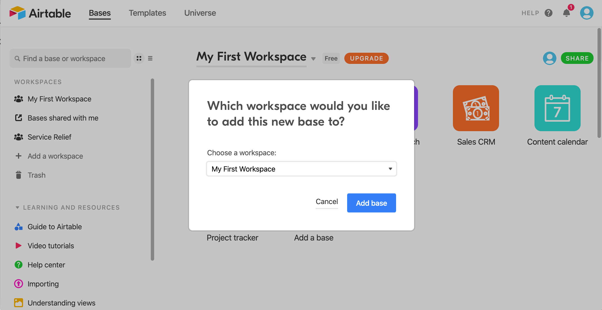

Then you should see several tiles that correspond to individual "Bases" that Airtable has set up for you. Look for "Service Relief Template".

👉🏼 Hover over the "Service Relief Template" tile, and click the "down" caret that appears. Replace the text **"Service Relief Template"** with something like **"Service Relief Austin"**. (_Use your city name_).

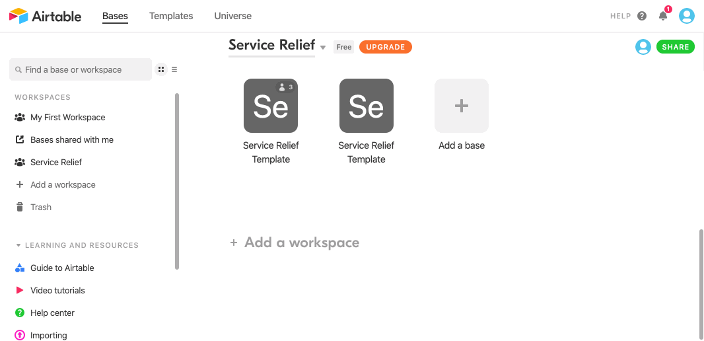

### Collect keys from Airtable

In order for your site to grab the data from your Airtable document, you'll need to collect **4 key values**.

Copy the following snippet into a text file.

```
AIRTABLE_API_KEY=key00000000000000
AIRTABLE_BASE_ID=app00000000000000
AIRTABLE_TABLE_NAME=tbl00000000000
AIRTABLE_EMBED_ID=shr0000000000000
```

#### Collect Airtable API key

> Your **API key** is secret, sort of like a key for a safe deposit box. Don't share it.

👉🏼 Visit your [Airtable account](https://airtable.com/account), and find the "API" section.

👉🏼 Click the "Generate API key" button.

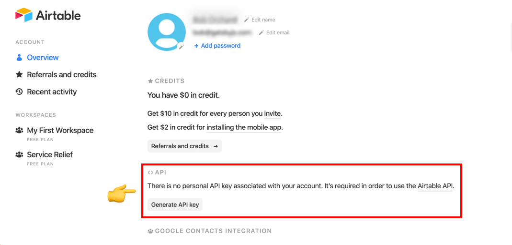

👉🏼 Click on the dots to show your key, and copy it.


👉🏼 Paste the key in your text file as the value for `AIRTABLE_API_KEY`.

For example, if my key were `key123`, it would look like this:

```
AIRTABLE_API_KEY=key123
AIRTABLE_BASE_ID=app00000000000000
AIRTABLE_TABLE_NAME=tbl00000000000
AIRTABLE_EMBED_ID=shr0000000000000
```

#### Collect Airtable Base Id

👉🏼 Visit [the Airtable API page](https://airtable.com/api).

👉🏼 Click on the base you just created and renamed for your city.

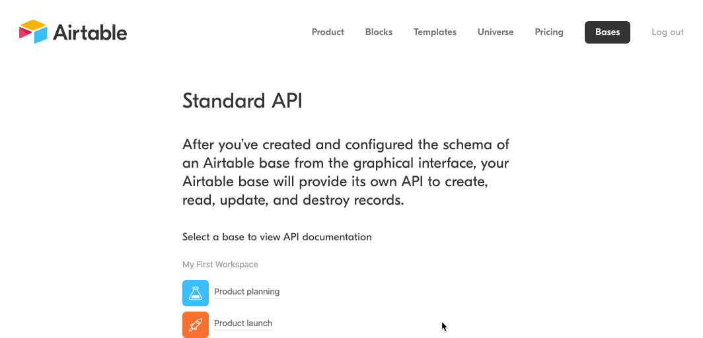

👉🏼 Copy the base id found halfway down the page (highlighted in the gif above).

👉🏼 Paste the id in your text file as the value for `AIRTABLE_BASE_ID`.

For example, if my key were `app123`, it would look like this:

```
AIRTABLE_API_KEY=key123
AIRTABLE_BASE_ID=app123
AIRTABLE_TABLE_NAME=tbl00000000000
AIRTABLE_EMBED_ID=shr0000000000000
```

#### Collect Airtable Table Id

👉🏼 Visit the Airtable base you've created for your city by visiting the [Airtable homepage](https://airtable.com/) and then clicking the tile for your base.

You can find your table id in part of the url. After `https://airtable.com/`, copy everything before the next `/`. For example, in the following URL:

`https://airtable.com/tbl6QXLCylcd2ukYr/viw0PQQWbtAfxZ8qa`

The part you need would be `tbl6QXLCylcd2ukYr`.

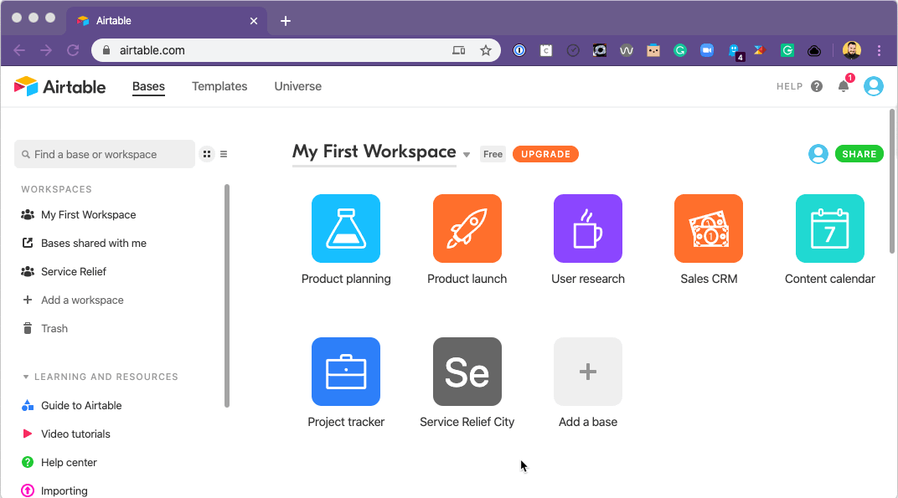

👉🏼 Paste the table id in your text file as the value for `AIRTABLE_TABLE_NAME`.

For example, if my table id were `tbl123`, it would look like this:

```
AIRTABLE_API_KEY=key123
AIRTABLE_BASE_ID=app123
AIRTABLE_TABLE_NAME=tbl123
AIRTABLE_EMBED_ID=shr0000000000000
```

#### Collect Airtable Embed Id

👉🏼 Click the "Grid View" at the top left of your base.

👉🏼 Select "Submit a Fundraiser". This will take you to the form view, a submission form created automatically, which corresponds to your Airtable base.

👉🏼 Click "Share Form". You should see a link. Copy everything after `https://airtable.com/`.

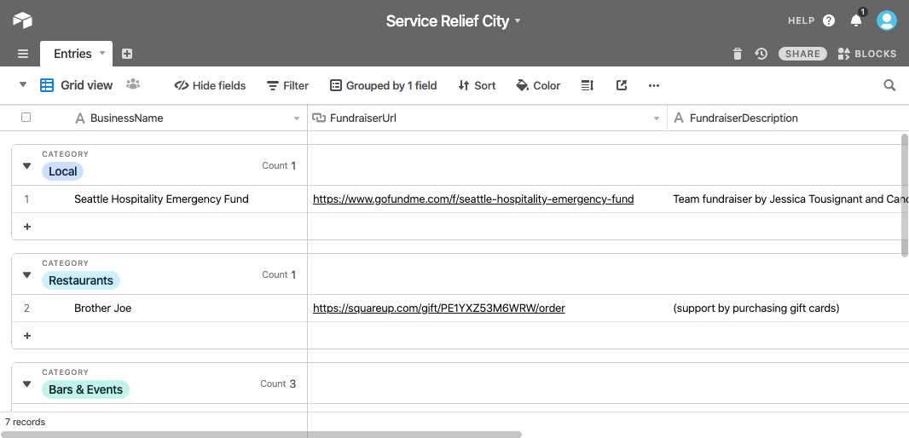

👉🏼 Paste the embed id in your text file as the value for `AIRTABLE_EMBED_ID`.

For example, if my table id were `shr123`, it would look like this:

```
AIRTABLE_API_KEY=key123
AIRTABLE_BASE_ID=app123
AIRTABLE_TABLE_NAME=tbl123
AIRTABLE_EMBED_ID=shr123
```

With all four values collected, you're ready to set up the site.

### 3️⃣ Deploy Your Site

#### Deploy to Netlify

> _Note: We plan to set up instructions for other providers eventually, as well._

👉🏼 Click the button below to begin the process of deploying to Netlify.

[](https://app.netlify.com/start/deploy?repository=https://github.com/service-relief/gatsby-starter-service-relief)

👉🏼 Click "Connect to GitHub". (_You should already be logged in, but if you're not, log in_).

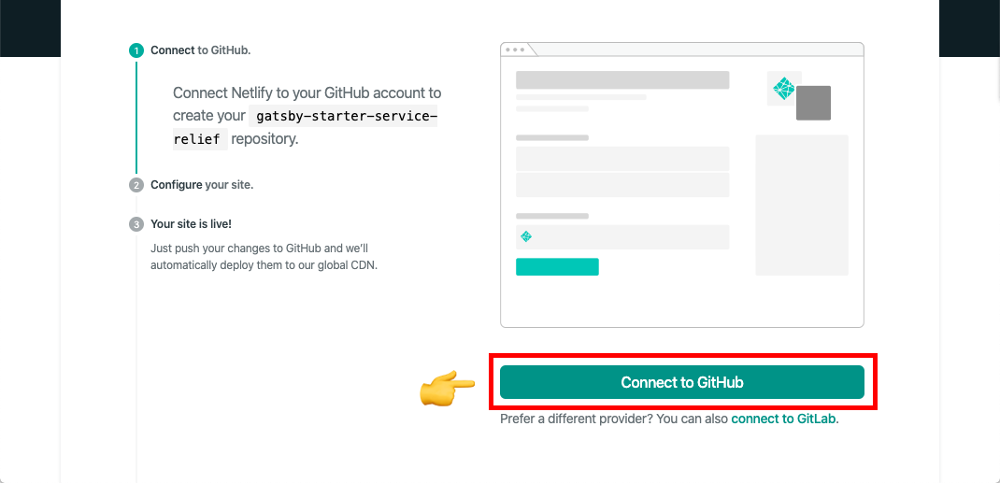

👉🏼 For the repository name, use something like `service-relief-austin` (_using your city, of course_).

👉🏼 Use the text file with your four Airtable values to populate the prompts for API key, base id, table name, and embed id.

👉🏼 In the final two prompts, specify your city and state. (_We'll use this to personalize your site a bit_).

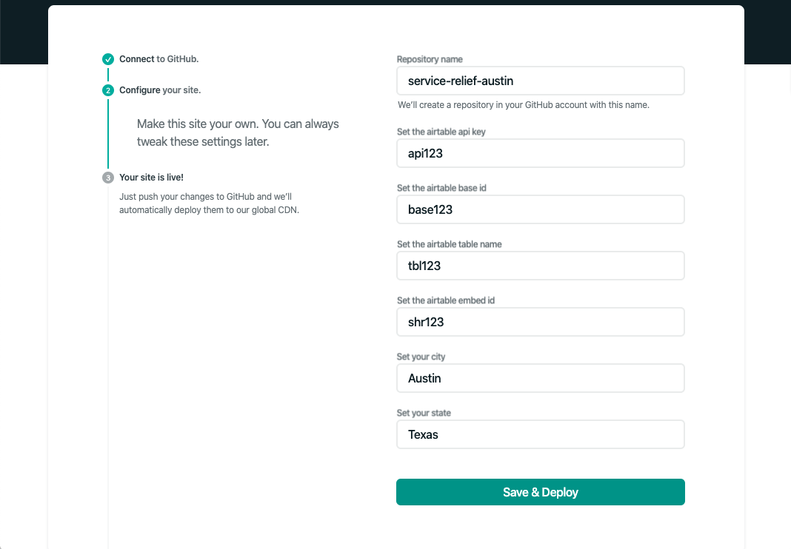

👉🏼 Click "Save and Deploy".

It will take a little while for your new site to build. You'll see the message "Site deploy in progress".

When the build is published, you'll see a live green link under the site title:

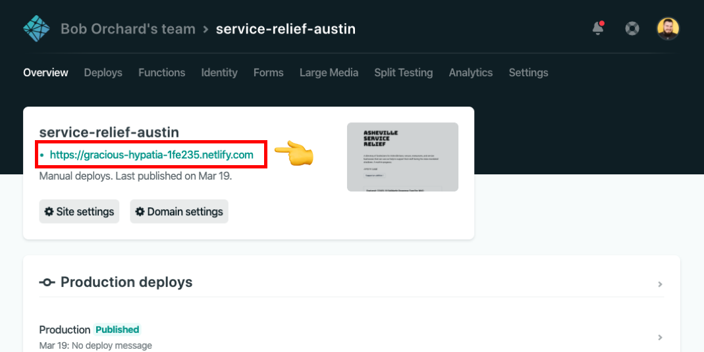

#### Customize the site domain

You can set a custom domain in your Netlify site settings. From your site's main admin page on Netlify:

👉🏼 Click "Domain Settings".

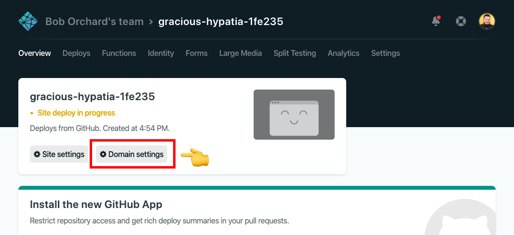

👉🏼 Under "Custom Domains", click "Add Custom Domain".

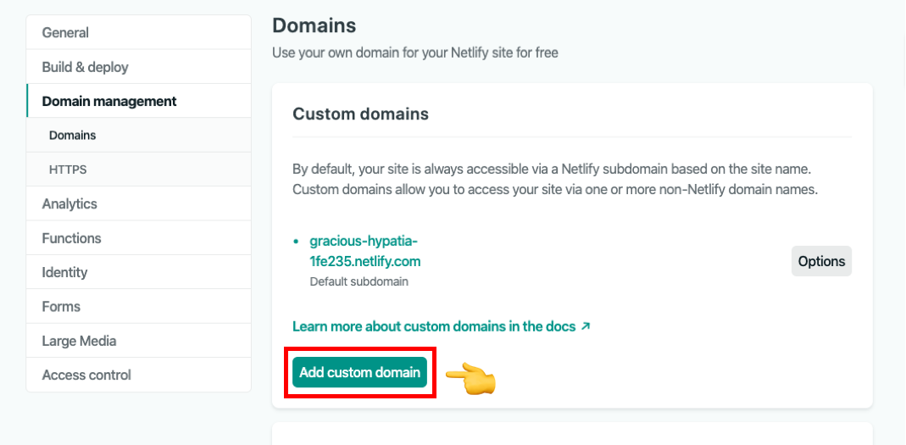.

From there, follow the steps to add your domain.

### 4️⃣ Go Live

_@TODO_
